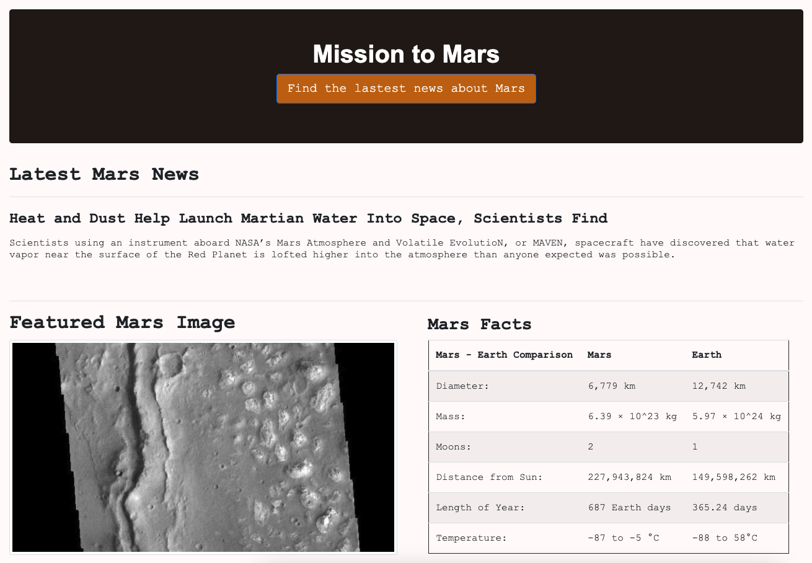

# Mission to Mars - Web Scraping Project


[`image source: https://i.imgur.com/IiQPugr.jpg` ](https://i.imgur.com/IiQPugr.jpg)

## Background

This assignment aims to showcase of web scraping and rendering skills from the previous lessions. In this project, the final product is a web application which has a function to scrape through several websites, extract information and display them on a html page.

Below is a walk through the scraping and rendering processes:

## Step 1 - Scraping

The scraping process is performed in [mission_to_mars.ipynb](https://github.com/KeSavanh/web-scraping-challenge/blob/main/mission_to_mars/mission_to_mars.ipynb) by ultilizing web scraping tools like: BeautifulSoup, Splinder and Pandas. Below are scraping procedure from different sites:

### NASA Mars News
A list of latest news titles and paragraph texts is collected by scraping through [Mars News Site](https://redplanetscience.com/). 

```
****************************************************************************************************
6 Things to Know About NASA's Ingenuity Mars Helicopter
------------------------------
The first helicopter attempting to fly on another planet is a marvel of engineering. Get up to speed with these key facts about its plans.
****************************************************************************************************
```

### JPL Mars Space Images - Featured Image

Using splinder to navigate to [https://spaceimages-mars.com](https://spaceimages-mars.com) 

```
https://spaceimages-mars.com/image/featured/mars1.jpg

```

### Mars Facts


### Mars Hemispheres

```
[{'title': 'Cerberus Hemisphere Enhanced', 'img_url': 'https://marshemispheres.com/images/f5e372a36edfa389625da6d0cc25d905_cerberus_enhanced.tif_full.jpg'}, {'title': 'Schiaparelli Hemisphere Enhanced', 'img_url': 'https://marshemispheres.com/images/3778f7b43bbbc89d6e3cfabb3613ba93_schiaparelli_enhanced.tif_full.jpg'}, {'title': 'Syrtis Major Hemisphere Enhanced', 'img_url': 'https://marshemispheres.com/images/555e6403a6ddd7ba16ddb0e471cadcf7_syrtis_major_enhanced.tif_full.jpg'}, {'title': 'Valles Marineris Hemisphere Enhanced', 'img_url': 'https://marshemispheres.com/images/b3c7c6c9138f57b4756be9b9c43e3a48_valles_marineris_enhanced.tif_full.jpg'}]

```

## Step 2 

### MongoDB 


### Flask Application

The final application is:


